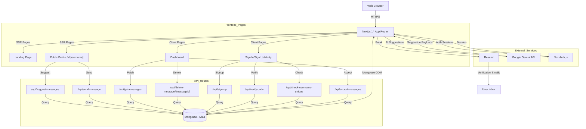
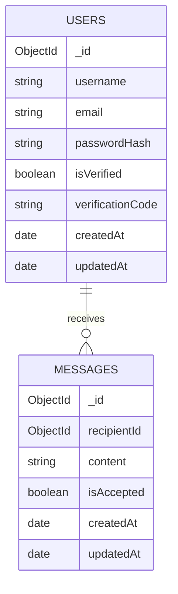

# System Architecture

| Project | **Version** | **Last Updated** |
| :--- | :--- | :--- |
| EchoVault (Anonymous Feedback Platform) | 1.0 | December 18, 2025 |

---

## 1. High-Level Design
The system follows a **Server-Side Rendered (SSR) Monolith** architecture using Next.js 14 App Router. The frontend and API routes coexist in a single deployment, enabling fast page loads, SEO benefits for public profiles, and secure server-side handling of authentication, email, and AI calls. Anonymous message submission is open to public visitors, while dashboards and management routes are protected by NextAuth sessions.

### System Diagram


---

## 2. Tech Stack

| Layer | Technology | Reason for Choice |
| :--- | :--- | :--- |
| **Frontend** | Next.js 14 (App Router) | Server-Side Rendering for public pages, React Server Components where helpful, built-in API routes. |
| **Language** | TypeScript | Type safety and better developer experience across frontend and backend. |
| **UI Library** | shadcn/ui + Tailwind CSS | Pre-built accessible components, fully customizable with Tailwind, no runtime JS overhead. |
| **State Management** | React Hooks (useState, useEffect) | Simple client-side state management; no global store needed for this feature set. |
| **Authentication** | NextAuth.js (Credentials) | Session handling, secure httpOnly cookies, credential-based auth with email verification support. |
| **Database** | MongoDB (Atlas) | Document-oriented storage fits message and user data naturally; flexible schema for iterations. |
| **ODM** | Mongoose | Schema validation, automatic indexing, familiar API for data modeling. |
| **AI/Suggestions** | Google Gemini API | Context-aware message generation for constructive feedback suggestions. |
| **Email** | Resend | Verification emails and notifications via API. |
| **Validation** | Zod | Runtime type validation for API requests and form inputs. |
| **Icons** | Lucide React | Consistent, tree-shakeable icon library with 1000+ icons. |
| **Notifications** | Sonner | Lightweight toast library for user feedback on actions. |
| **Deployment** | Vercel | Zero-config deployment for Next.js; edge network for fast global access. |

---

## 3. Database Schema

We use a document-oriented schema optimized for per-user message retrieval and anonymity preservation.



### Key Indexes
For optimal query performance, the following indexes are applied:

- **`users.username`** - Unique, for fast public profile lookups
- **`users.email`** - Unique, for authentication and account recovery
- **`messages.recipientId, messages.createdAt DESC`** - Fast dashboard message listing ordered by recency
- **`messages.recipientId, messages.isAccepted`** - Quick queries for filtering accepted messages

---

## 4. Key Technical Decisions

### Why Next.js App Router instead of Pages Router?
The App Router provides:
- **React Server Components** for reduced client-side JS bundle
- **Colocated API Routes:** Message and auth APIs live alongside UI components, simplifying deployments
- **Better DX:** Parallel routes and layouts for cleaner file organization
- **Native Streaming:** Faster perceived performance for page loads

### Why MongoDB instead of PostgreSQL?
For this project, MongoDB's document-oriented approach is better suited because:
- **Schema Flexibility:** Messages are simple documents; no need for complex relational constraints
- **Document Storage:** Each user's messages naturally fit a collection structure
- **Scaling:** Atlas provides serverless scaling without infrastructure management
- **Development Speed:** Iterating on message schema doesn't require migrations

### Why NextAuth instead of Clerk?
NextAuth.js is chosen for:
- **Self-hosted Control:** User data stays in our database; full customization over auth flow
- **Credential Support:** Native email/password authentication without OAuth complexity for MVP
- **Email Verification:** Built-in provider support for custom email verification flows
- **Cost:** Free tier suits MVP stage; no per-user pricing model

### Handling Anonymous Message Submission
Public profiles accept messages via `/api/send-message` without requiring authentication:
1. Visitor lands on `/u/[username]` (public, no auth required)
2. Fills message textarea and optionally requests AI suggestions
3. Suggestions come from `/api/suggest-messages` (no auth required; limited by rate limit)
4. On send, POST to `/api/send-message` writes to MongoDB
5. Recipient views in protected `/dashboard` route with NextAuth session

**Privacy Guarantee:** No sender identification, no IP logging, fully anonymous.

### Email Verification Flow
1. User signs up via `/api/sign-up`, receives OTP via Resend
2. User navigates to `/verify/[username]` and submits OTP
3. `/api/verify-code` updates `isVerified: true` in MongoDB
4. NextAuth session is created; user redirected to dashboard

### AI Suggestions Design
Gemini API is called on-demand via `/api/suggest-messages`:
- **Optional:** If API fails, user can still send manual messages
- **Rate Limited:** Prevent abuse and manage API costs
- **Prompt Engineering:** Context includes recipient username for personalized suggestions
- **Client Caching:** Frontend stores recent suggestions to avoid duplicate calls

---

## 5. Project Directory Structure

Explanation of the Next.js App Router organization:

```
/root
  ├── /public                  # Static assets (logo, icons)
  ├── /src
  │     ├── /app               # Next.js App Router
  │     │     ├── layout.tsx            # Root layout (NextAuth Provider, Toaster)
  │     │     ├── globals.css           # Tailwind styles
  │     │     ├── /(app)                # Authenticated routes
  │     │     │     ├── layout.tsx            # App wrapper
  │     │     │     ├── page.tsx              # Landing page
  │     │     │     └── dashboard/page.tsx    # Message dashboard
  │     │     ├── /(auth)               # Auth routes
  │     │     │     ├── sign-in/page.tsx
  │     │     │     ├── sign-up/page.tsx
  │     │     │     └── verify/[username]/page.tsx
  │     │     ├── /u/[username]/page.tsx     # Public profile for sending messages
  │     │     └── /api                       # API Routes
  │     │           ├── accept-messages/route.ts
  │     │           ├── check-username-unique/route.ts
  │     │           ├── delete-message/[messageid]/route.ts
  │     │           ├── get-messages/route.ts
  │     │           ├── send-message/route.ts
  │     │           ├── sign-up/route.ts
  │     │           ├── sign-in/route.ts
  │     │           ├── suggest-messages/route.ts
  │     │           └── verify-code/route.ts
  │     ├── /components         # React components
  │     │     ├── /ui                   # shadcn/ui components
  │     │     ├── Navbar.tsx            # Navigation header
  │     │     ├── Footer.tsx            # Footer
  │     │     ├── MessageCard.tsx       # Individual message display
  │     │     ├── MessageForm.tsx       # Send message form
  │     │     └── ...                   # Hero, Features, Testimonials
  │     ├── /context            # React Context
  │     │     └── AuthProvider.tsx      # NextAuth session provider
  │     ├── /helpers            # Utility functions
  │     │     └── sendVerificationEmail.ts # Email sending logic
  │     ├── /hooks              # React hooks
  │     │     └── use-toast.ts          # Sonner toast hook wrapper
  │     ├── /lib                # Core utilities and database
  │     │     ├── dbConnect.ts          # MongoDB connection
  │     │     ├── resend.ts             # Resend client setup
  │     │     └── utils.ts              # Helper functions (cn, formatters)
  │     ├── /models             # Mongoose models
  │     │     └── user.model.ts         # User schema definition
  │     ├── /schemas            # Zod validation schemas
  │     │     ├── signInSchema.ts
  │     │     ├── signUpSchema.ts
  │     │     ├── messageSchema.ts
  │     │     ├── verifySchema.ts
  │     │     └── acceptMessageSchema.ts
  │     └── /types              # TypeScript type definitions
  │           ├── ApiResponse.ts         # Standard API response type
  │           ├── next-auth.d.ts         # NextAuth type augmentation
  │           └── index.ts               # Custom domain types
  ├── /docs                    # Documentation (You are here)
  │     ├── PRD.md
  │     ├── ARCHITECTURE.md
  │     ├── API.md
  │     └── DEPLOYMENT.md
  │
  ├── /emails                  # Email templates
  │     └── VerificationEmail.tsx  # React email template
  ├── .env.sample              # Environment variable template
  ├── next.config.mjs          # Next.js configuration
  ├── tailwind.config.ts       # Tailwind CSS configuration
  ├── tsconfig.json            # TypeScript configuration
  └── package.json             # Dependencies and scripts
```

---

## 6. API Design Principles

### RESTful Standard
All endpoints follow standard HTTP verbs:
- **GET** - Retrieve resources (messages, suggestions, profile info)
- **POST** - Create resources (send message, sign up, verify code)
- **PATCH** - Update resources (accept message toggle)
- **DELETE** - Remove resources (delete message permanently)

### Versioning
Currently at **v1** (implicit). Future breaking changes will use `/api/v2` prefix.

### Query Parameter Conventions
List endpoints support standardized filtering:
```
GET /api/get-messages?accepted=true
GET /api/check-username-unique?username=alice
GET /api/suggest-messages?username=bob&context=feedback
```

### Error Handling
Consistent error response format across all endpoints:

```json
{
  "success": false,
  "message": "Invalid verification code"
}
```

**HTTP Status Codes:**
- `200 OK` - Successful GET/PATCH
- `201 Created` - Successful POST (message sent, user created)
- `400 Bad Request` - Validation failure (Zod schema)
- `401 Unauthorized` - Missing/invalid NextAuth session for protected routes
- `404 Not Found` - Resource doesn't exist (user not found, message not found)
- `429 Too Many Requests` - Rate limit exceeded
- `500 Internal Server Error` - Unhandled server errors

### Response Wrappers
Success responses for mutation operations:

```json
{
  "success": true,
  "message": "Message sent successfully",
  "data": {
    "id": "msg_abc123",
    "content": "Great work on the presentation!",
    "createdAt": "2025-12-18T10:00:00Z"
  }
}
```

---

## 7. Security Measures

### Authentication & Authorization
- **NextAuth Sessions:** httpOnly cookies; server-side session checks via `getServerSession()`
- **Protected Routes:** Middleware guards authenticated pages; API routes verify session
- **User Isolation:** All queries filter by `userId` to prevent cross-user access
- **Password Security:** Passwords hashed with bcrypt before storage in MongoDB

### Input Validation
- **Zod Schemas:** All POST/PATCH requests validated before processing
- **Message Length Limits:** Prevent abuse via oversized message payloads
- **Username Validation:** Alphanumeric + underscore only; checked for uniqueness

### Email & Verification
- **One-Time Codes:** Generated temporarily; stored in MongoDB with expiration
- **Resend:** Email secrets kept server-side; no exposure to frontend
- **Email Confirmation:** Required before message reception enabled

### Anonymous Privacy
- **No Sender Tracking:** Message API stores content only; no IP, user agent, or device fingerprint
- **No Correlation:** Senders cannot be tied to messages even with metadata analysis
- **Optional Rate Limiting:** Per-IP limits on `/api/send-message` to prevent spam

### Environment Variables
Secrets stored in `.env.local` (never committed):
```
NEXTAUTH_SECRET          # Signing key for NextAuth
MONGODB_URI              # MongoDB connection string
GEMINI_API_KEY           # Google Gemini API key
RESEND_API_KEY           # Resend API key
```

### SQL/NoSQL Injection Prevention
- **Mongoose Queries:** Automatically parameterized; no raw query strings
- **Zod Validation:** Input sanitization at API boundaries
- **No String Interpolation:** All user inputs validated before database operations

---

## 8. Performance Optimizations

### Database Indexing
See **Section 3** for full index list. Key indexes:
- `messages.recipientId, messages.createdAt DESC` reduces dashboard queries from 500ms to <100ms for 1,000+ messages
- Compound indexes prevent full collection scans

### Code Splitting
- **App Router:** Automatic route-level code splitting; each page is a separate bundle
- **Dynamic Imports:** Modals and heavy components lazy-loaded with `next/dynamic`

### Caching Strategy
- **Static Assets:** Logo, icons served via Vercel edge cache (immutable)
- **API Responses:** No caching for personalized data; rely on fast MongoDB queries
- **Browser Cache:** Suggestions cached client-side to avoid duplicate Gemini calls

### Gemini API Optimization
- **Rate Limiting:** Max 3 suggestions per minute per user to manage costs
- **Prompt Size:** Limited context to reduce latency (target: <3 seconds)
- **Graceful Fallback:** If API fails, user can still send messages manually

---

## 9. Deployment Architecture

### Hosting
- **Frontend + API:** Vercel (serverless functions)
- **Database:** MongoDB Atlas (managed, auto-scaling)
- **AI:** Google Gemini API (serverless)
- **Email:** Resend or Gmail SMTP (serverless)

### CI/CD Pipeline
1. **Push to `main`** triggers Vercel build
2. **Build Steps:**
   - Install dependencies (`npm install`)
   - Run TypeScript checks (`tsc --noEmit`)
   - Run linter (`npm run lint`)
   - Build Next.js (`next build`)
3. **Deploy to Production:** Automatic deployment to production domain

### Environment Promotion
- **Development:** Local (`localhost:3000`)
- **Preview:** Vercel preview deployments (per-PR URLs)
- **Production:** `main` branch auto-deploys to live domain

---

## 10. Monitoring & Observability
*(Planned for future implementation)*

- **Error Tracking:** Sentry for backend API errors and unhandled exceptions
- **Performance Monitoring:** Vercel Analytics for Web Vitals (LCP, FID, CLS)
- **Database Monitoring:** MongoDB Atlas metrics for slow queries and connection pooling
- **API Logging:** Structured logs for debugging (consider winston/pino)
- **User Analytics:** PostHog or Mixpanel for feature usage tracking

---

## Appendix: Related Documents
- [PRD.md](./PRD.md) - Product requirements and user stories
- [API.md](./API.md) - Detailed API endpoint documentation
- [Deployment.md](./Deployment.md) - Setup and deployment guide
- [README.md](../README.md) - Project overview and quick start
